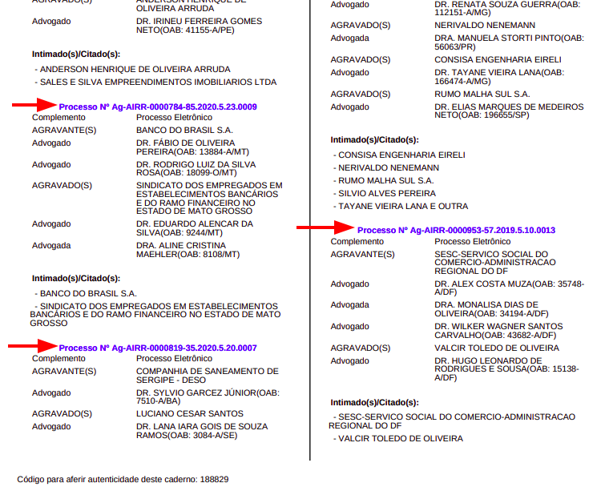
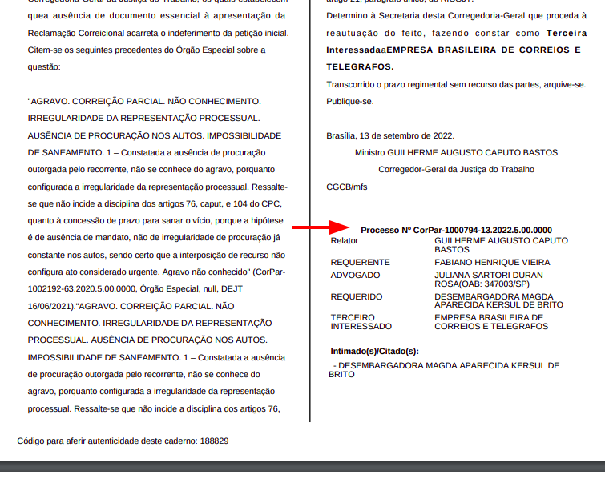
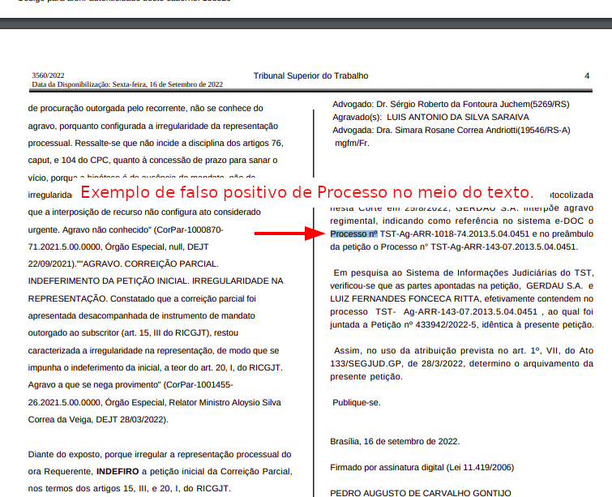

# Extrator de processos dos cadernos do TST

# Extrator
  
A execução deste programa iniciará o fluxo de extração dos dados.  
💡 por uma questão de tempo para entrega, esta versão é um MVP e realizará o processo mínimo para atender a solicitação. Com muita tristeza 🥲 no coração serão ignorados alguns controles de e prevenções de erro, mas na próxima versão serão tratados e contigênciados para uma melhor performance.

## Requisitos

### Windows
 - utilizar o Windowns 10 ou superior
 - ter o [Google Chrome version 106](src/webdriver/chromedriver/windows_ChromeSetup_ver-106.0.5249.119_21-10-2022.exe) instalado

### Linux
 - ter o [docker](https://docs.docker.com/desktop/install/linux-install/) e [docker-compose](https://docs.docker.com/compose/install/) instalados


## Instalação e execução
### Windows
 - realizar o download deste repositório em um pasta
 - executar o arquivo ```extrator.exe```

### Linux
 - realizar o download deste repositório em um diretório
 - executar o docker com o seguinte comando:
   - ```sudo docker xxx yyy zzz```


# Briefing

Dado o link do tribunal abaixo, capture:
 - Baixar os cadernos do TST da última semana
 - Extrair os números de processo de cada caderno
 - Gerar planilhas de saída com todos os números de processos separados por dia da semana
o Ex. TST 13/10/2022.xlsx
 - Caso um processo apareça repetido em mais de um dia, gerar relatório de duplicatas com os respectivos processos e suas datas.

Link do tribunal: [https://dejt.jt.jus.br/dejt/f/n/diariocon](https://dejt.jt.jus.br/dejt/f/n/diariocon)


## Algoritmo

### Mapeamento do processo para extração

#### Input e pesquisa dos cadernos
1. abrir url [https://dejt.jt.jus.br/dejt/f/n/diariocon](https://dejt.jt.jus.br/dejt/f/n/diariocon)
2. localizar dropdown do campo "Órgão":
   1. xpath:  ```//select[@id='corpo:formulario:tribunal']```
   2. usar o id "corpo:formulario:tribunal"
3. localizar o value TST
   1. xpath: ```//*[@id="corpo:formulario:tribunal"]/option[2]```
   2. atualmente está no value="0"
      1. o melhor é mapear pela string "TST"
4. inserir a data no campo "Data de Inicio"
   1. ```//input[@id='corpo:formulario:dataIni']```
   2. usar o id 'corpo:formulario:dataIni' 
5. inserir a data no campo "Data de Fim"
   1. ```//input[@id='corpo:formulario:dataFim']```
   2. usar o id 'corpo:formulario:dataFim'
6. clicar no botão Pesquisar
   1. mapear o xpath ```//div[@class='plc-corpo-acao-t'][contains(.,'Pesquisar')]```

#### Coleta dos resultados:  

##### Em caso de erro:
1. verificar se há erro:  
   1. xpath: ```//p[contains(.,'Nenhum registro que atende aos critérios informados foi encontrado! Refine a pesquisa por outro parâmetro!')]```
         1. talvez mapear por pelo menos uma palavra chave: "Nenhum"
      2. ou ainda melhor, pegar pelo id "corpo:formulario:ajaxMensagem"
         1. xpath: ```//*[@id="corpo:formulario:ajaxMensagem"]```
            1. ⚠️Atenção: se tudo estiver ok, o conteudo está em branco sem texto

##### Em caso de Sucesso:
1. se não houver mensagem no ```id="corpo:formulario:ajaxMensagem"``` e tiver resultado para baixar:
   1. localizar quantos arquivos aparecem nas linhas tr ```//*[@id="diarioCon"]//table[contains(@class,'plc-table-tabsel plc-table-tabsel plc-table-tabsel plc-table-tabsel plc-table-tabsel delimitador tabelaSelecao')]//tr```
   2. captura as informações do primeiro td com a Data do arquivo ```//*[@id="diarioCon"]//table[contains(@class,'plc-table-tabsel plc-table-tabsel plc-table-tabsel plc-table-tabsel plc-table-tabsel delimitador tabelaSelecao')]//tr/td[1]```
   3. captura as informações do segundo td com o Nome do arquivo ```//*[@id="diarioCon"]//table[contains(@class,'plc-table-tabsel plc-table-tabsel plc-table-tabsel plc-table-tabsel plc-table-tabsel delimitador tabelaSelecao')]//tr/td[2]```
   4. captura as informações do terceiro td com o button de download do arquivo ```//*[@id="diarioCon"]//table[contains(@class,'plc-table-tabsel plc-table-tabsel plc-table-tabsel plc-table-tabsel plc-table-tabsel delimitador tabelaSelecao')]//tr/td[3]```
2. ⚠️Atenção: tem que observar que quando ultrapassa 30 arquivos, cria uma nova pagina com os proximos arquivos. Acredito que 7 dias não ultrapassará 30 arquivos, mas é bom deixar mapeado.
   1. identificar se há pelo menos um botão de proxima página ```(//span[contains(@class,'ico iNavProximo')])```
      2. enquanto houver, clica no primeiro para avançar ```(//span[contains(@class,'ico iNavProximo')])[1]```
   2. quando não tiver mais botão de avançar, é porque acabou as páginas.
3. ⚠️quando trocar de página, testar se o texto do ```//*[@id="diarioNav"]/table/tbody/tr/td[2]``` muda de uma página para outra antes de começar a baixar os arquivos.

#### Tratamento dos arquivos pdfs baixados
1. salvar os pdfs em um TMP
2. extrair os textos dos pdfs
3. fazer um parser e capturar as propostas como no exemplo ```Processo Nº CorPar-1000794-13.2022.5.00.0000```
   1. normalmente há uma quebra de linha antes
   2. a linha começa por ```Processo Nº ``` e termina com um número ```[0-9]```
   3. atenção para falso positivo do "Processo Nº" no meio de textos que não um "título"

    <picture>
      
    </picture>
    <picture>
      
    </picture>
    <picture>
      
    </picture>

## Bibliotecas

### Selenium e Webdriver
Para realizar a extração dos arquivos do dite será utilizado o Selenium e um webdriver.  
Para uma maior compatibilidade será usado o chromedriver, preferencialmente sempre a versão estável mais recente.
 - [controle de versões do chromedrive](src/webdriver/chromedriver/version.md)  

Dica chrome:
 - parametro para defir um diretorio para o usuario:
   - ```"C:\Program Files\Google\Chrome\Application\chrome.exe" --user-data-dir=C:\App\chrome\02 --restore-last-session```
 

### PyPDF2, Tabula, Tika
É necessário utilizar uma biblioteca para fazer a leitura do arquivo pdf e extrair seu conteudo em formato de texto.  
Em seguida realizar um parser ou find para coletar as strings com os termos de para localizar e extrair os "Processos"

#### dicas
 - http://theautomatic.net/2020/01/21/how-to-read-pdf-files-with-python/#:~:text=To%20read%20PDF%20files%20with%20Python%2C%20we%20can%20focus%20most,able%20to%20highlight%20the%20text.
 - https://www.hashtagtreinamentos.com/ler-tabelas-em-pdf-com-python?gclid=CjwKCAjwwL6aBhBlEiwADycBIP5IlXlBAGNeCccMVSLiewxB8dP67xzJxJjX5V-1mVE1I27tRejMdRoC22EQAvD_BwE
 - PyPDF2, Tabula: https://www.computersciencemaster.com.br/como-ler-pdf-com-python/
 - Tika: https://dadosaocubo.com/extraindo-texto-de-arquivos-pdf-com-python/

### converter py em exe

#### dicas:
 - https://pt.stackoverflow.com/questions/316707/converter-python-em-exe
 - http://ptcomputador.com/P/python-programming/94137.html
 - cx_Freeze: https://www.alura.com.br/artigos/criando-um-executavel-a-partir-de-um-programa-python
 - https://www.pyinstaller.org/
 - http://www.py2exe.org/
 - https://anthony-tuininga.github.io/cx_Freeze/
 - py_compile: https://pt.stackoverflow.com/questions/432012/converter-arquivos-py-para-arquivos-exe
 - https://pt.stackoverflow.com/questions/13806/como-criar-um-execut%C3%A1vel-exe-em-python
 - https://pyoxidizer.readthedocs.io/en/latest/
 - https://shiv.readthedocs.io/en/latest/
 - cx_Freeze win32: https://pt.stackoverflow.com/questions/183381/como-criar-um-execut%C3%A1vel-a-partir-de-python

### Pandas
Será utilizado o pandas para gerar os arquivos arquivos xls com os resultados das consultas conforme informado no Briefing.

# Considerações finais
Esse é um projeto bastante interessante e é possível torná-lo em um SaaS.  

Como melhorias para uma V2 pode-se sugerir as seguintes tecnologias:
 - Docker para mantê-lo conteirnizado e assim torná-lo portável e executável em qualquer OS
 - Flask para criar uma interface web amigavel para o usuário poder interagir
   - também criar rotas a fim de transfomá-lo em uma API 
 - opção de selecionar uma data específica ou um range diferente do default(últimos 7 dias
 - Message Broker, como o RabbitMQ para aceitar múltiplas requisições, colocar elas em fila, e executar uma a uma
 - torná-lo um serviço na Nuvem, hospedando em um Azure, GCP ou DigitalOcean, por exemplo.
 - Realizar os tratamentos de erros, captura das mensagens de erros/sucesso, informação do total de arquivos localizados/baixados. Criar stamps de Data/Hora.
 - Utilizar um BD para guardar os registros das datas já pesquisadas, agilizando quando realizar uma busca de uma data que já foi processada anteriormente.
 - Utilizar variaveis de ambientes ```env var```
 - Utilizar um arquivo de configurações ```config.ini```